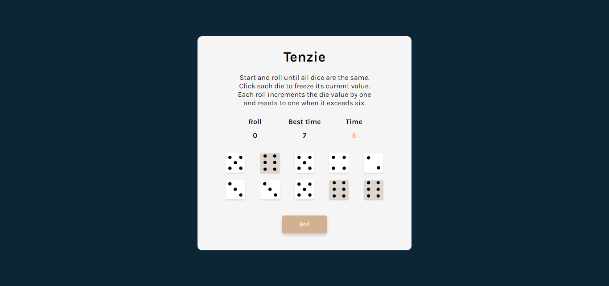

# Dice Game - Simple React App

This is a simple React-based dice game called **Tenzie**. The goal is to roll dice until they all display the same number. Players can hold specific dice to prevent them from rolling.

## Features

* Roll the dice until all have the same value.
* Click on dice to hold them in place.
* Tracks the number of rolls and elapsed time.
* Displays the best time, stored in local storage.
* Confetti animation upon winning.

## Setup

1. Clone the repository and navigate to the project directory.
2. Install dependencies using `npm install`.
3. Start the development server with `npm start`.

## Screenshots

Enjoy the game!

